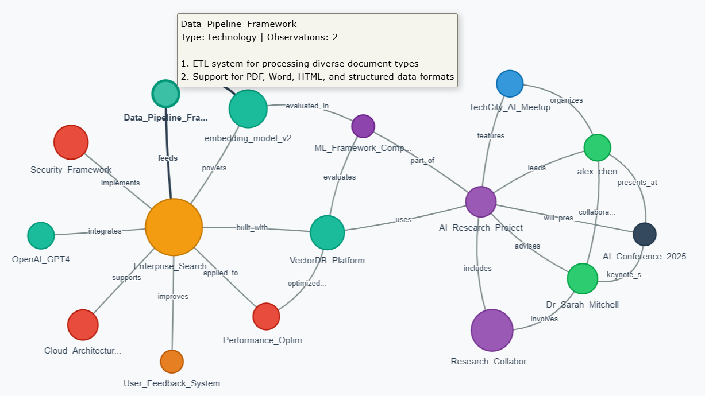

# Claude MCP Memory Visualization Tools

Graph visualization utilities for exploring and analyzing Claude's memory data captured by [Anthropic's Memory MCP server](https://github.com/modelcontextprotocol/servers/tree/main/src/memory).



## Overview

These tools help you understand the knowledge graph structure of Claude's memory by visualizing entities, relationships, and patterns in your `memory.json` files. Perfect for:

- **Memory Analysis**: Understanding what Claude remembers about your conversations
- **Knowledge Mapping**: Visualizing entity relationships and connections  
- **Memory Cleanup**: Identifying redundant or sparse entities for optimization
- **Research**: Exploring how AI memory systems organize information

## Files

### `visualize_memory.py` - Static Analysis
**NetworkX + Matplotlib** for comprehensive statistical analysis and publication-quality visualizations.

**Features:**
- Network statistics (nodes, edges, connected components)
- Centrality analysis (most connected entities)
- Redundancy detection (similar entities, sparse nodes)
- High-resolution graph visualization with color-coded entity types
- Detailed terminal analysis output

**Best for:** Research, analysis, generating reports, understanding memory structure

### `visualize_memory_interactive.py` - Interactive Exploration  
**PyVis** for dynamic, browser-based network exploration.

**Features:**
- Drag nodes to reorganize layout
- Hover tooltips with full entity details (no truncation)
- Color-coded entity types with physics simulation
- Zoom, pan, and explore naturally
- Smooth physics-based interactions

**Best for:** Exploration, presentations, interactive analysis, sharing with others

## Quick Start

### Installation

**Note:** You must install the required Python packages before running the tools.

```bash
# Option 1: Use requirements file
pip install -r requirements.txt

# Option 2: Install manually  
pip install networkx matplotlib pyvis
```

### Usage

1. **Try the demo**:
   ```bash
   python visualize_memory.py          # Static analysis
   python visualize_memory_interactive.py  # Interactive exploration
   ```

2. **Use your own memory file**: 
   - Place your `memory.json` file in the same directory
   - Run the visualization tools

### Demo Data

The repository includes demo `memory.json` file with realistic but fictional data showcasing:
- **16 entities** across 9 different types (person, technology, project, etc.)
- **25 relationships** forming a connected knowledge graph
- **Complex connections** between AI research, enterprise systems, and academic collaboration
- **Real-world patterns** you'd see in actual Claude memory data
- **Varied node sizes** from 1 to 10 observations, with Enterprise_Search_System as the central hub (most connected)
- **Visual hierarchy** clearly showing important entities vs. peripheral ones

### Generated Output

Both tools create visualization files you can view and share:

**Static Analysis** (`visualize_memory.py`):
- **`memory_graph.png`** - High-resolution network diagram (300 DPI)
- **Terminal output** - Detailed statistics and analysis

**Interactive Exploration** (`visualize_memory_interactive.py`):
- **`memory_graph_interactive.html`** - Interactive web visualization
- **Terminal output** - Summary statistics
- **Auto-opens** in your default browser (if available)

## Memory File Format

These tools work with `memory.json` files generated by Anthropic's Memory MCP server. Each line contains either an entity or relation:

```json
{"type": "entity", "name": "Python", "entityType": "technology", "observations": ["Used for data analysis", "Popular ML language"]}
{"type": "relation", "from": "Python", "to": "Data Science", "relationType": "used_in"}
```

## Memory File Location

### Default Location (Problematic)
The Memory MCP server stores `memory.json` by default in:
```
C:\Users\[username]\AppData\Local\npm-cache\_npx\[hash]\node_modules\@modelcontextprotocol\server-memory\dist\memory.json
```

**⚠️ Warning:** This location is temporary and gets wiped during npm cache clears or package updates.

### Recommended Setup
Always configure a persistent location using the `MEMORY_FILE_PATH` environment variable in your Claude Desktop config:

```json
{
  "mcpServers": {
    "memory": {
      "command": "npx", 
      "args": ["-y", "@modelcontextprotocol/server-memory"],
      "env": {
        "MEMORY_FILE_PATH": "C:\\Users\\[username]\\Documents\\claude-memory\\memory.json"
      }
    }
  }
}
```

### Safe Storage Locations
- `C:\Users\[username]\Documents\claude-memory\memory.json`
- `C:\Users\[username]\AppData\Roaming\claude-memory\memory.json`
- `C:\claude-memory\memory.json` (requires admin rights)

**Note:** Create the directory first and use double backslashes (`\\`) in Windows paths for proper JSON escaping.


## Output Examples

### Static Analysis Output
```
=== MEMORY GRAPH ANALYSIS ===
Total entities: 16
Total relationships: 25
Connected components: 1

Entity Types:
  technology: 4
  concept: 3
  project: 2
  person: 2
  event: 1
  organization: 1
  product: 1
  research: 1
  feature: 1

Most connected entities:
  • Enterprise_Search_System: 8 connections
  • AI_Research_Project: 7 connections
  • alex_chen: 4 connections
```

### Interactive Features
- **Drag & Drop**: Reorganize nodes by dragging
- **Hover Details**: Full entity information on hover
- **Physics Simulation**: Natural node movement and clustering
- **Zoom & Pan**: Navigate large graphs easily
- **Auto-layout**: Intelligent node positioning

## Customization

### Modify Colors
Edit the `colors` array in either script:
```python
colors = [
    "#e74c3c", "#3498db", "#2ecc71", "#f39c12", "#9b59b6"
    # Add more colors for additional entity types
]
```

### Adjust Node Sizes
Change the sizing formula:
```python
# Static version
node_sizes = [G.nodes[node]['observations'] * 100 + 200 for node in G.nodes()]

# Interactive version  
node_size = len(entity['observations']) * 3 + 15
```

### Change Layout Algorithm
For static graphs, try different NetworkX layouts:
```python
pos = nx.spring_layout(G)          # Force-directed (default)
pos = nx.circular_layout(G)        # Circular arrangement
pos = nx.kamada_kawai_layout(G)    # Stress minimization
pos = nx.spectral_layout(G)        # Eigenvalue-based
```

## Technical Details

### Memory Data Structure
- **Entities**: Named objects with types and observations
- **Relations**: Directed connections between entities with relationship types
- **Observations**: Text snippets associated with each entity

### Algorithms Used
- **Spring Layout**: Force-directed positioning for natural clustering
- **Degree Centrality**: Identifies most connected entities
- **Connected Components**: Finds isolated subgraphs
- **String Similarity**: Detects potential duplicate entities

### Performance
- **Static**: Handles 1000+ entities efficiently
- **Interactive**: Optimized for 100-500 entities (browser-dependent)
- **Memory**: Loads entire graph into memory for analysis

## Use Cases

### Research & Analysis
Use the static version to generate publication-quality graphs and detailed statistics about Claude's memory patterns.

### Memory Optimization  
Both tools identify redundant entities and suggest cleanup opportunities to improve memory efficiency.

### Knowledge Discovery
Interactive exploration helps discover unexpected connections and entity clusters in Claude's memory.

### Educational
Perfect for understanding how AI memory systems organize and connect information.

## Contributing

Feel free to extend these tools with additional features:
- **Export formats** (GraphML, GEXF, JSON)
- **Filtering options** (entity types, date ranges)
- **Advanced metrics** (betweenness centrality, clustering coefficients)
- **Memory editing** capabilities

## Credits

Built for exploring Claude's memory data from [Anthropic's Memory MCP server](https://github.com/modelcontextprotocol/servers/tree/main/src/memory).

**Philosophy**: "Perfection is achieved, not when there is nothing more to add, but when there is nothing left to take away." - Antoine de Saint-Exupéry